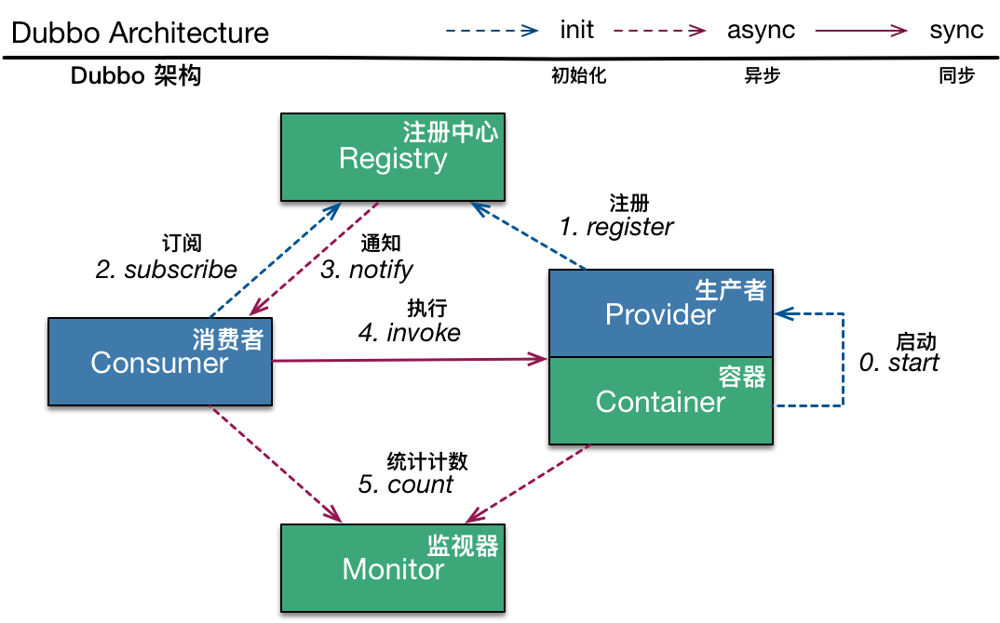

# dubbo.io

## 预览

>   ​	Dubbo是一套由Alibaba开源的高性能,基于Java的RPC(远程过程调用)框架.如同许多RPC系统一样,dubbo也同样是围绕Service定义的一套实现,他指定了一些能通过参数类型和返回值类型去远程调用的方法.在服务器Server这端,有实现了这些接口interface和运行一套dubbo去处理客户端Client的调用.而在客户端Client这边,有一套能提供和服务器Server相同方法的存根,即实现.
>
>   
>
>   ​	Dubbo提供三种关键性的功能,他们包括基于远程调用的接口,容错处理和负载均衡以及自动服务注册和服务检索.Dubbo框架也广泛地适用于Alibaba内部甚至像京东,当当网,去哪儿,网易考拉等等外部公司中.


## 快速上手

>   ​	该向导能让你通过一套简单且可运行的Java代码示例去快速上手dubbo.你可以在这个[dubbo项目](https://github.com/alibaba/dubbo)的`dubbo-demo`目录中找到完整且可运行的示例代码.f
>
>
>   #### 准备
>
>   *   JDK:版本不低于JDK6
>   *   Maven:版本不低于Maven 3
>
>   #### Maven的相关依赖
>
>   ​	你可能需要使用最新版本的`maven-central(v2.5.7)`去编译你的dubbo应用.
>
>   ```xml
>   <dependency>
>   	<groupId>com.alibaba</groupId>
>   	<artifactId>dubbo</artifactId>
>   	<version>2.5.7</version>
>   </dependency>
>   ```
>
>     #### 定义`service interface` (接口层)
>
>   自从`service provider`和`service consumer`依赖相同的接口开始,我们强烈建议将`interface`的定义放在一个独立的`module`模块下,该`module`都被`provider module`和`consumer module`共用.
>
>    ```java
>   package com.alibaba.dubbo.demo;
>
>   public interface DemoService {
>     String sayHello(String name);
>   }
>    ```
>
>   #### 实现`service provider`
>
>   ```java
>   package com.alibaba.dubbo.demo.provider;
>   import com.alibaba.dubbo.demo.DemoService;
>
>   public class DemoServiceImpl implements DemoService {
>     public String sayHello(String name) {
>       return "Hello " + name;
>     }
>   }
>   ```
>
>   #### 配置`service provider`
>
>   下面显示的代码片段展示了一个dubbo的`service provider`如何用于Spring框架的配置中,这也是我们推荐你应该这样使用它,不过你同样可以依你所好,使用[API confguration](https://dubbo.gitbooks.io/dubbo-user-book/content/configuration/api.html).
>
>   ```xml
>   <?xml version="1.0" encoding="UTF-8"?>
>   <beans xmlns="http://www.springframework.org/schema/beans"
>          xmlns:xsi="http://www.w3.org/2001/XMLSchema-instance"
>          xmlns:dubbo="http://code.alibabatech.com/schema/dubbo"
>          xsi:schemaLocation="http://www.springframework.org/schema/beans http://www.springframework.org/schema/beans/spring-beans.xsd http://code.alibabatech.com/schema/dubbo http://code.alibabatech.com/schema/dubbo/dubbo.xsd">
>   	<dubbo:application name="demo-provider" />
>   	<dubbo:registry address="multicast://224.5.6.7:1234" />
>   	<dubbo:protocol name="dubo" port="20880" />
>   	<dubbo:service interface="com.alibaba.dubbo.demo.DemoService" ref="demoService" />
>   	<bean id="demoService" class="com.alibaba.dubbo.demo.provider.DemoServiceImpl" />
>   </beans>
>   ```
>
>   #### 开启`service provider`
>
>   ```java
>   import org.springframework.context.support.ClassPathXmlApplicationContext;
>
>   public class Provider {
>     public static void main(String[] args) throws Exception {
>       ClassPathXmlApplicationContext context = new ClassPathXmlApplicationContext(
>       new String[] {"META-INF/spring/dubbo-demo-provider.xml"});
>       context.start();
>       System.in.read();	//按任意键退出
>     }
>   }
>   ```
>
>   #### 配置`service consumer`
>
>   下面的代码示范了再一次对Spring的整合
>
>   ```xml
>   <?xml version="1.0" encoding="UTF-8"?>
>   <beans xmlns="http://www.springframework.org/schema/beans"
>          xmlns:xsi="http://www.w3.org/2001/XMLSchema-instance"
>          xmlns:dubbo="http://code.alibabatech.com/schema/dubbo"
>          xsi:schemaLocation="http://www.springframework.org/schema/beans http://www.springframework.org/schema/beans/spring-beans.xsd http://code.alibabatech.com/schema/dubbo http://code.alibabatech.com/schema/dubbo/dubbo.xsd">
>       <dubbo:application name="demo-consumer"/>
>       <dubbo:registry address="multicast://224.5.6.7:1234"/>
>       <dubbo:reference id="demoService" interface="com.alibaba.dubbo.demo.DemoService"/>
>   </beans>
>   ```
>
>   #### 运行`service consumer`
>
>   ```java
>   import com.alibaba.dubbo.demo.DemoService;
>   import org.springframework.context.support.ClassPathXmlApplicationContext;
>
>   public static void main (String[] args) throws Exception {
>     ClassPathXmlApplicationContext context = new ClassPathXmlApplicationContext(new String[] {"META-INF/spring/dubbo-demo-consumer.xml"});
>     context.start();
>     DemoService demoService = (DemoService) context.getBean("demoService");	//获得远程调用的代理对象
>     String hello = demoService.sayHello("world");	//执行远程调用
>     System.out.println(hello);	//展示结果
>   }
>   ```

## 下一步您可以...

>   *   深入[dubbo 用户手册](http://dubbo.io/books/dubbo-user-book/)或[下载pdf](https://raw.githubusercontent.com/dubbo/dubbo.github.io/master/docs/dubbo-user-book.pdf)去获得更多使用细节,或者[在gitter上交流](https://gitter.im/alibaba/dubbo?utm_source=badge&utm_medium=badge&utm_campaign=pr-badge).
>   *   阅读针对dubbo应用管理方面的[dubbo管理手册](http://dubbo.io/books/dubbo-admin-book/)或[下载pdf](https://raw.githubusercontent.com/dubbo/dubbo.github.io/master/docs/dubbo-admin-book.pdf).
>   *   对构建dubbo感兴趣或是想要提供你的代码给dubbo?请阅读[dubbo开发者手册](http://dubbo.io/books/dubbo-dev-book/)或下载[pdf](https://raw.githubusercontent.com/dubbo/dubbo.github.io/master/docs/dubbo-dev-book.pdf),然后开始[编写你的代码](https://github.com/alibaba/dubbo).
